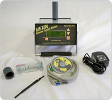

# Plan

## Wireframes
* [Mobile](https://wireframe.cc/yvDm4q)

 
 

* [Desktop](https://wireframe.cc/4yfL0L?authuser=0)

 
 

## Colors
* `#ABC123`
* `9593d9`
* `7C90DB`
* `AB92BF`

## Fonts
* [Playwrite Romania](https://fonts.google.com/specimen/Playwrite+RO)
* [Raleway](https://fonts.google.com/specimen/Raleway)

## Images
* 
* 
* 

## Timeline

#### MVP

**DUE 5/5**

* 4/24
  * Wait for approval, Once approved:
  * Start working on Narbar + Title

* 4/26
 * Resubmit Wireframe
 * adding in links + any other font or color needed
 * Start coding with Navbar + Title
   * If have time start to add in context

* 4/28
 * Start to work on adding in context + images
 * Add in other components if needed

* 5/3
  * Add in finishing touches
  * Finalize design 

---

#### Beyond MVP

* Add in more components to make it not boring
* Fixing anything
* Add in different fonts + colors

* Fix Narbar
* Add in some margin and paddin to fix my website
* Adjust content such as the links   

#### Peer Feedback

| Name | Glows | Grows |
|----  |----   |----|
| Winnie |I like how your website included the sources on the side, I find this very interesting as not much people did this. I also like ur layout | A suggestion is to make the image smaller. Since when we change the size of the screen the image become super big. |
| Jolee  | I liked the clear visuals of the devices and also the reference links you added so we'd know where you got your information from.  | A suggestion I have is to change the color scheme of your website and so also add some margin and padding so each element is distinctable to the next. 
| Farzona  | I like how you included sources becasue some people could want to know more about your topic and don't know where to find it. So, putting soucres was a good idea. | One thing you should consider is trying to make your navbar work becasue currently when I click the parts of your website, it doesnt bring me to them.  
| Gabriel  |  I like the basic layout of it and  how easy it is to navigate | I dont think the menu can close becausse when I click the button nothing happens. Also the sources are just kinda there and it interrupts the flow of the websites so I think that could be put out of the way but still visible
|   |   |
|   |   |
|   |   |

